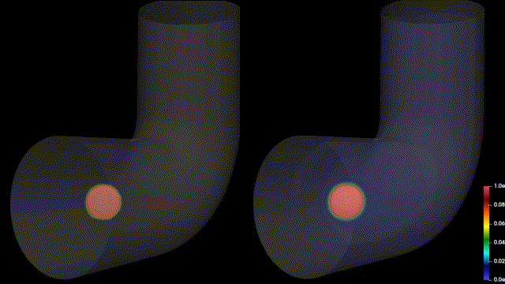

# General coupled Navier-Stokes-Diffusion equations solver using finite element method

This repository contains a general fluid flow solver, implemented in FreeFEM language (very similar to C++) using the finite element method. The model also includes a simple diffusion equation coupled with the Navier-Stokes equations. It supports MEDIT and GMSH unstructured grids as the input and contains the implementation of both 2D and 3D systems.

Here is a sample output of the code for a diffusion-convection problem in a 3D bend pipe in two different diffusion rates. The mesh files for this problem, in both coarse and fine generated setup, as well as a simple 2D problem, are provided in the `mesh` folder. The postprocessing has been done using ParaView and NVIDIA IndeX.

The code works in parallel to achieve a better performance, something that is crucial for finer meshes and 3D cases. In this regard, first, the computational mesh is decomposed into smaller sub-meshes (using HPDDM), and the equations are discretized independently in these sub-domains. Then, the assembled linear system of equations is solved using appropriate preconditioners and iterative solvers (using PETSc). These steps are implemented using the easy-to-use PETSc interface in FreeFEM, making it convenient to modify various effective parameters and observe the impact on computational performance.

## Getting started

The code is implemented in FreeFEM, so a parallel version of FreeFEM should be installed. A proper MPI runtime is required to run parallel FreeFEM (such as OpenMPI or MPICH). The PETSc module should also be installed and linked to FreeFEM (which is usually the default config for installing/compiling FreeFEM). The installation procedure can be found [here](https://doc.freefem.org/introduction/installation.html) for different platforms.

After installing the required software packages, the code can be run like this:

`$ mpirun -n 4 FreeFem++-mpi ns_3d.edp -v 0`

You can specify the number of employed cores (which also implies the number of mesh sub-partitions) by the `-n` switch (it is 4 in this example). The `-v 0` switch is used to suppress the verbosity of FreeFEM. For the 2D model, the input file is `ns_2d.edp`. The configs (such as the input mesh or the output location) can be modified in the source files.

## Repository structure

This repository consists of the following files/directories:

* `ns_3d.edp`: transient 3D Navier-Stokes code coupled with a diffusion model, implemented using the characteristics method and a fieldsplit preconditioner
* `ns_2d.edp`: transient 2D Navier-Stokes code coupled with a diffusion model, implemented using the characteristics method and an exact factorization preconditioner
* `ns_2d_snes.edp`: transient 2D Navier-Stokes code implemented using the Newton-Raphson method and SNES non-linear solver
* `navier_stokes-finite_element.pdf`: detailed explanation of the theory behind the finite element implementation and preconditioning of the Navier-Stokes equations
* `mesh/`: directory containing sample mesh files
* `output/`: directory to which the results (VTK files) will be written
